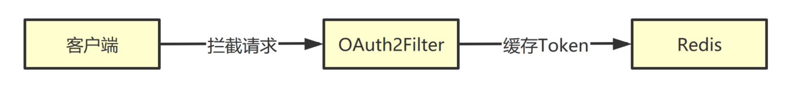
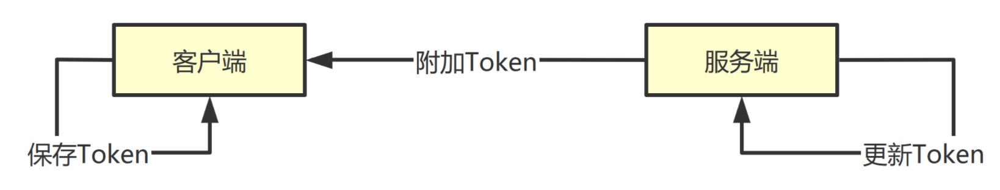
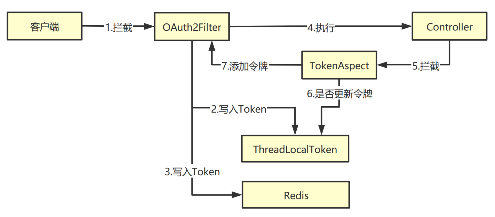

# 令牌的刷新设计

## 问题描述

令牌`Token`一旦生成就保存在客户端, 即便用户一直在登录使用系统, 也不会重新生成令牌. 如果令牌到期, 用户必须重新登录, 这样就很不合理了.

**令牌应该支持自动续期.**

## 可能方案

### 方案一: 双令牌机制

用户登录时设置两个令牌, 长日期令牌和短日期令牌. 两个令牌都要保存在客户端. 客户端每次发起请求都要把两个令牌提交给服务器验证. 当短日期令牌失效以后, 服务端就使用长日期令牌, 并重新生成两个令牌(长短日期)返回给客户端,
客户端更新两个令牌实现刷新.

如果长日期令牌也失效了, 就要重新登录.

### 方案二: 缓存令牌

用户登录时服务端生成一个`token`, 返回给客户端保存的同时也把`token`缓存在服务端. 服务端缓存的`token`的过期时间是客户端`token`过期时间的一倍.

- 如果客户端令牌过期, 缓存令牌没有过期, 则生成新的令牌
- 如果客户端令牌过期, 缓存令牌也过期了, 则需要重新登录

## 缓存令牌

Token 缓存方案是把 Token 缓存到 Redis，设置 Redis 里面缓存的 Token 过期时间为正常 Token 的 1 倍, 然后根据情况刷新 Token 的过期时间.

如果 Redis 中存在缓存的`token`, 说明当前`token`失效后间隔时间还未过有效期, 不应该让用户重新登录. 要生成新的`token`返回给客户端, 并且把这个`token`缓存到Redis, 这种操作刷新`token`
过期时间.

当用户的`token`失效以后, 让 Shiro 程序到 Redis 查看是否存在缓存的`token`. 如果这个`token`不存在于 Redis 就说明用户的操作间隔过长, 需要重新登录.

## 客户端更新令牌

服务端刷新`token`过期时间其实就是生成一个新的`token`给客户端. 只要用户成功登陆系统, 当后端服务器更新`token`的时候, 就在响应中添加`token`. 客户端判断每次Ajax响应里面是否 包含`token`.
如果包含就把`token`保存起来.

## 在响应中添加令牌

