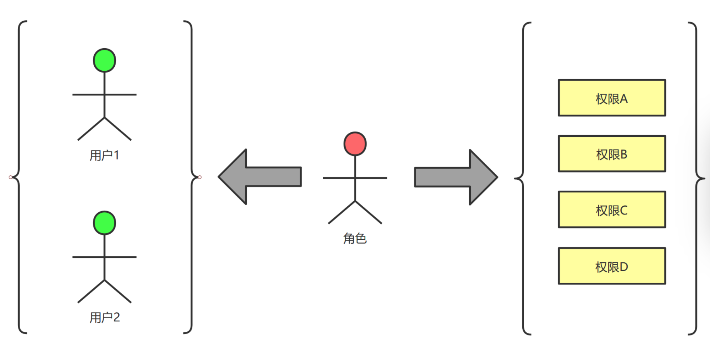
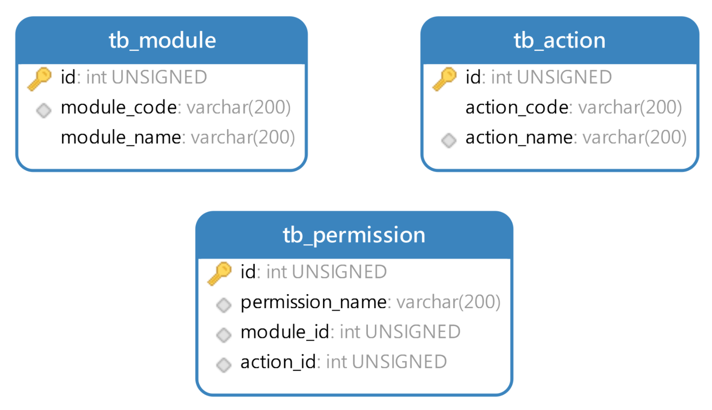
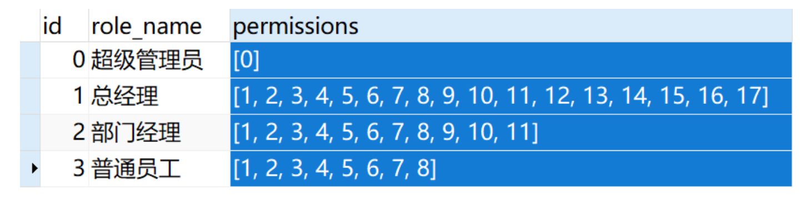

# RBAC权限模型

## 什么是RBAC
**RBAC: Role Bases Access Control**

传统的权限管理流程是, 系统注册了新用户之后需要管理员手动为用户勾选权限, 非常麻烦.

RBAC的基本思想是, 对系统操作的各种权限不是直接授予具体的用户, 而是在用户集合与权限集合之间建立一个角色集合. 
每一种角色对应一组相应的权限, 一旦用户被分配了适当的角色后, 该用户就拥有此角色的所有操作权限. 
这样做的好处是不必在每次创建用户时都进行分配权限的操作, 只要分配用户相应的角色即可. 而且角色的权限变更比用户的权限变更要少得多,
这样将简化用户的权限管理, 减少系统的开销.

RBAC模型中的权限是由模块和行为合并在一起而产生的. 在MySQL中, 有模块表(`tb_module`)和行为表(`tb_action`).
这两张表的记录合并在一起就行程了权限记录, 保存在权限表(`tb_permission`)中.

把权限关联到角色中, 传统一点的做法是创建一个交叉表, 记录角色拥有什么权限. 但是现在MySQL5.7之后引入了JSON数据类型, 
所以可以在角色表(`tb_role`)中设置`permissions`字段, 类型是JSON格式.

到目前为止, JSON类型已经支持索引机制, 所以我们不用担心存放在JSON字段中的数据检索速度慢. 
MySQL为JSON类型配备了很多函数, 我们可以很方便的读写JSON字段中的数据.

在用户表(`tb_user`)上面设置`role`字段, 类型依旧是JSON, 这样就可以把多个角色关联到某个用户身上.

## 前后端权限验证
关于权限验证的工作, 前端要做, 后端也要做. 后端的权限验证通过Shiro框架可以解决, 但是移动端没有权限验证框架, 
所以需要自己封装函数来验证权限. 每个页面在渲染的时候先判断用户拥有什么权限, 然后根据权限控制渲染的内容. 
比如说普通员工没有添加新员工的权限, 所以界面上就不能出现添加按钮.

移动端做权限判断的前提是必须有当前用户的权限列表, 这个权限列表是用户登陆成功或者注册成功, 后端Java项目返回给移动端的, 
移动端保存到本地Storage里面.